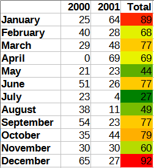

# Analyzing Company Distress from Enron Emails 
**Matthew Kubisa; Gordon Liang**

This document is a transcription of the formal written report submitted alongside our project for class.

## Problem
Enron was one of America's most successful companies in the late 1990s until it suffered from a scandal and subsequent bankruptcy in late 2001. During the investigation of Enron's collapse, a dataset of Enron emails was obtained by the Federal Energy Regulatory Commision [1]. The Enron Email Dataset is publicly available in Kaggle [2]. We aim to determine from the email dataset if there were noticeable signs of distress within the Enron staff in the months leading to the company's collapse. To do so, we ran a series of queries to judge:

* Query 1 - Determining sentiment within the company.
    * We focused on determining internal sentiment at Enron by analyzing the number emails sent to and from Enron employees within between a timeframe (February and June 2000). We filtered for negative and positive keywords in the email body to determine if it has a positive or negative sentiment.
* Query 2 - Determining sentiment displayed to employees of other companies.
    * We analyzed the number of emails sent from Enron employees to emails that are not from Enron, including bcc and cc recipients. Similarly to query 1, we filtered for negative and positive keywords to determine the attitude of Enron employees towards outside companies.
* Query 3 - Frequency of language related to resignation over a two-year period.
    * We analyzed emails with keywords related to resignation or departure within Enron. We analyzed the date of these emails to determine the frequency of resignations within the company.

The data contains a sample of over 500,000 emails from about 150 Enron employees. We then cleaned up the dataset, to separate out key fields such as "To", "From", and "Date" for easier parsing. This is the data we use in our MongoDB database [3]. Both databases are publicly available and listed in our references.

## Software Design and Implementation
Our implementation stores our data in a locally-hosted MongoDB database. We implemented a server using Express.js, which provides a framework for building web applications in Node.js [4]. We connected the server to the MongoDB database and defined the routes for each query. We utilized asynchronous functions to execute the queries and return the results to the client. For each query, we used MongoDB aggregation methods and operators as shown on the MongoDB Manual [5] to filter out our dataset and retrieve the correct output. Finally, an user-friendly interface is designed using HTML and CSS, featuring buttons for each query. Each button click will asynchronously request data from the server and then update the HTML content with the corresponding query output.

To assist in writing our queries and setting up the database, we used MongoDB Compass [6], a GUI interface for MongoDB databases developed by the MongoDB developers. This is not the same as the web interface we implemented.

## Results
Query 1 analyzes internal sentiment at Enron by searching emails for keywords which correlate with positive and negative sentiment:

* Negative keywords: negative, frustrated, worried, awful, unsatisfied, disappointment, dissatisfaction
* Positive keywords: positive, happy, awesome, nice, glad, satisfied, pleased, success

Our analysis found that within a timeframe between February and June 2000, there were 351 emails with "negative" sentiment and 3674 emails with "positive" sentiment. The findings indicate a prevailing positive sentiment within the company during the specified timeframe. Since the company collapsed in December of the following year, this suggests the collapse was a sudden occurrence, and sentiment among employees was positive leading up to it.

Query 2 performs similar analysis to query 1, except it analyzes emails sent to or sent by people not employed by Enron. Our reasoning is that sentiment displayed to outside parties may differ from what internal morale would suggest. We found 19260 emails with "negative" sentiment, and 44518 emails with "positive" sentiment across the entire dataset, which suggests no difference between internal sentiment and what was displayed to outsiders. This indicated that Enron's communication with outside companies reflected a similar positivity observed internally.

Query 3 intends to judge the frequency of language related to resignation over a two-year period from January 2000 to December 2001. For each email within this timeframe, the query searches for keywords "resign," "termination," "resignation," "quit," "leave," "notice," and "departure," and takes note if the given email contains any of them. Our results are tabulated as follows:

This suggests turnover may have been more common towards the beginnings and ends of the years, and less common in the middle. In conclusion, the queries challenges the notion of prolonged distress within Enron prior to its collapse. Instead, the results suggest that the collapse of Enron may have been a sudden and unexpected event.

## References
1. Enron Email Dataset - Carnegie Mellon University. https://www.cs.cmu.edu/~./enron/
2. Enron Email Dataset. https://www.kaggle.com/datasets/wcukierski/enron-email-dataset/
3. Enron Email Dataset Cleansing Job. https://www.kaggle.com/code/gliang6/datacleansingjob/output
4. Express.js and MongoDB REST API Tutorial. https://www.mongodb.com/languages/express-mongodb-rest-api-tutorial
5. MongoDB Aggregation Framework. https://www.mongodb.com/docs/manual/aggregation/
6. MongoDB Compass. https://www.mongodb.com/try/download/compass
7. MongoDB Community Server. https://www.mongodb.com/try/download/community
8. Git - Downloads. https://git-scm.com/downloads
9. MongoDB Node.js Driver https://www.mongodb.com/docs/drivers/node/current/quick-start/download-and-install/